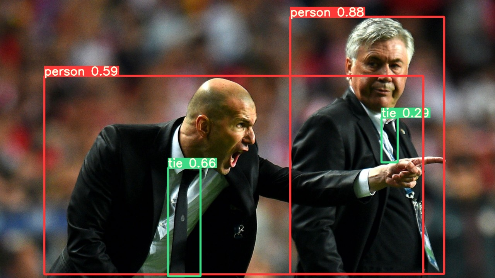

# __Yolo V5 Deepsort for Serbot Prime__
해당 Repository는 Nvidia Jetson Xavier보드 탑재되어 있는 Serbot Prime 제품에 YoloV5환경 구축 및 Coco Dataset 기반의 YoloV5 모델의 detection을 수행합니다.
### 개발환경
- __Hardware__
  - Nvidia Jetson Xavier AGX Board
  - Raspberry Pi Camera
- __Software__
  - jetpack 4.4
  - python 3.6
  - torch 1.7.0
  - torchvision 0.8.0

## __개발환경 구성__
### Pytorch, Torchvision 설치
Serbot에는 Pytorch 1.4가 설치되어 있다. YoloV5의 핵심적인 컨셉 중 하나인 `SiLU`를 사용하기 위해서는 `PyTorch 1.7` 이상의 버전이 필요하다. Pytorch를 업그레이드 및 설치하는 방법은 다음과 같다.
```shell
$ cd ~/
$ wget https://nvidia.box.com/shared/static/wa34qwrwtk9njtyarwt5nvo6imenfy26.whl -O torch-1.7.0-cp36-cp36m-linux_aarch64.whl
$ pip3 install torch-1.7.0-cp36-cp36m-linux_aarch64.whl
```
정상적으로 설치가 완료되었다면 `Python3`를 실행하고 Pytorch Version이 정상적으로 나오는지 확인한다.

```python
>> import torch as nn
>> print(nn.__version__)
>> 1.7.0
```
`Pytorch`가 설치 완료되었다면 이제 영상처리를 위한 `Torchvision`을 설치해야 한다. `Torchvision`은 `Pytorch` 버전에 종속적으로 설치되어야 하기 때문에 우리는 `0.8.0` 버전을 설치할 것이다.

```shell
$ cd ~/
$ git clone --branch v0.8.0 https://github.com/pytorch/vision torchvision
$ cd torchvision
$ export BUILD_VERSION=0.8.0
$ sudo python3 setup.py install
```

정상적으로 설치가 완료되었다면 `Python3`를 실행하고 Torchvision의 Version이 정상적으로 나오는지 확인한다.
```python
>> import torchvision as vision
>> print(vision.__verision__)
>> 0.8.0a
```

### Python 의존성 Package 설치
Serbot에는 기존 머신러닝을 위한 모듈이 설치되어 있기 때문에 추가 Package를 설치해줄 것이 한가지 뿐이다. `tqdm` 모듈은 `train`, `detect` 등 작업을 수행할 때 진척도를 표기해주는 모듈이다. 해당 모듈을 `pip`명령어로 설치를 해주도록 한다.

```shell
$ pip3 install tqdm
```
### yolov5 모듈 설치하기
이제 yolov5와 관련된 모듈을 설치할 것이다. `github`에서 리포지토리를 다운받아 설치를 진행한다.

```shell
$ cd ~/
$ git clone https://github.com/jungsuyun/yolov5_for_serbot.git
$ cd yolov5_for_serbot
$ sudo python setup.py install --record files.txt
```

## __동작 테스트__
```shell
$ cd ~/yolov5_for_serbot/yolov5
$ wget https://github.com/ultralytics/yolov5/releases/download/v5.0/yolov5s.pt
$ python3 detect.py --source data/images/zidane.jpg --weights yolov5s.pt
```


## __라이브러리 활용 예제__
### 웹캠에서 한프레임 읽어와서 추정값 출력하기
```python
from yolov5 import YOLOv5
from pop import Util
import cv2

Util.enable_imshow()

cam = Util.gstrmer(width=640, height=480)
camera = cv2.VideoCapture(cam, cv2.CAP_GSTREAMER)

if cammera.isOpened():
  model_path = "yolov5s.pt" #만약 학습한 데이터를 사용한다면 pt파일의 절대경로를 입력할 것!
  model = YOLOv5(model_path)

  ret, frame = camera.read()
  results = model.predict(frame)

  predictions = results.pred[0]
  boxes = predictions[:, :4]
  scores = predictions[:, 4]
  categories = predictions[:, 5]

  if(len(predictions) > 0):
      for i in range(len(predictions)):
          c1, c2 = (int(boxes[i][0]), int(boxes[i][1])), (int(boxes[i][2]), int(boxes[i][3]))
          confidence = round(float(scores[i]), 2)
          class_name = model.model.names[int(categories[i])]
          print(c1, c2, confidence, class_name)
          cv2.rectangle(frame, c1, c2, (255, 255, 0), cv2.LINE_4)
          cv2.putText(frame, (class_name + "/" + str(confidence)), (c1[0], c1[1] - 2), cv2.FONT_HERSHEY_PLAIN, 1, (255, 255, 255), cv2.LINE_4)
else:
  print("Not Found Camera!")
```

### 웹캠 영상에 BBOX, class, name, confidence 출력하기
```python
from yolov5 import YOLOv5
from pop import Util
import cv2

Util.enable_imshow()

cam = Util.gstrmer(width=640, height=480)
camera = cv2.VideoCapture(cam, cv2.CAP_GSTREAMER)

if cammera.isOpened():
  model_path = "yolov5s.pt" #만약 학습한 데이터를 사용한다면 pt파일의 절대경로를 입력할 것!
  model = YOLOv5(model_path)

  while True:
    ret, frame = camera.read()
    results = model.predict(frame)

    predictions = results.pred[0]
    boxes = predictions[:, :4]
    scores = predictions[:, 4]
    categories = predictions[:, 5]

    if(len(predictions) > 0):
        for i in range(len(predictions)):
            c1, c2 = (int(boxes[i][0]), int(boxes[i][1])), (int(boxes[i][2]), int(boxes[i][3]))
            confidence = round(float(scores[i]), 2)
            class_name = model.model.names[int(categories[i])]
            cv2.rectangle(frame, c1, c2, (255, 255, 0), cv2.LINE_4)
            cv2.putText(frame, (class_name + "/" + str(confidence)), (c1[0], c1[1] - 2), cv2.FONT_HERSHEY_PLAIN, 1, (255, 255, 255), cv2.LINE_4)
    cv2.imshow("output", frame)
else:
  print("Not Found Camera!")
```